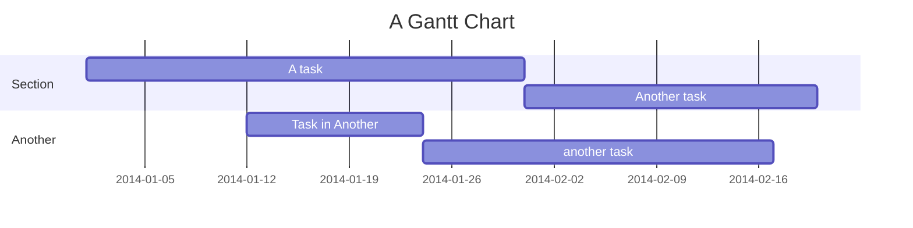
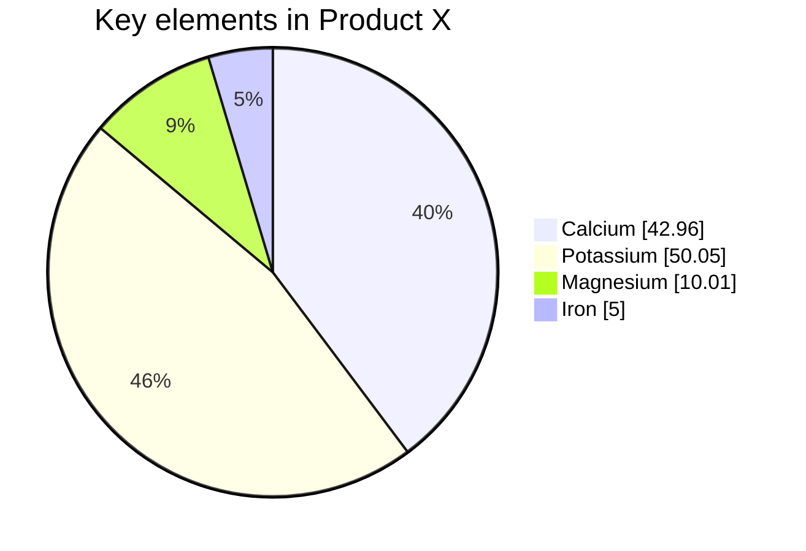
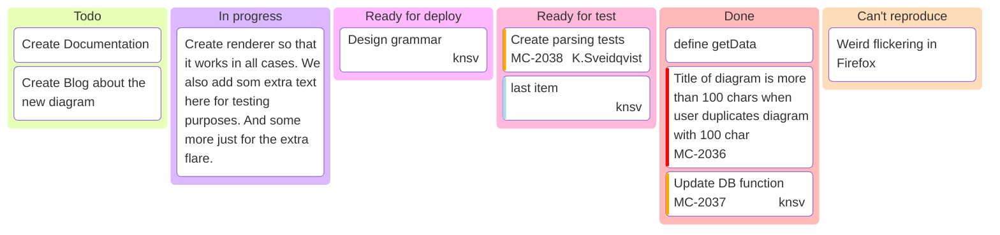
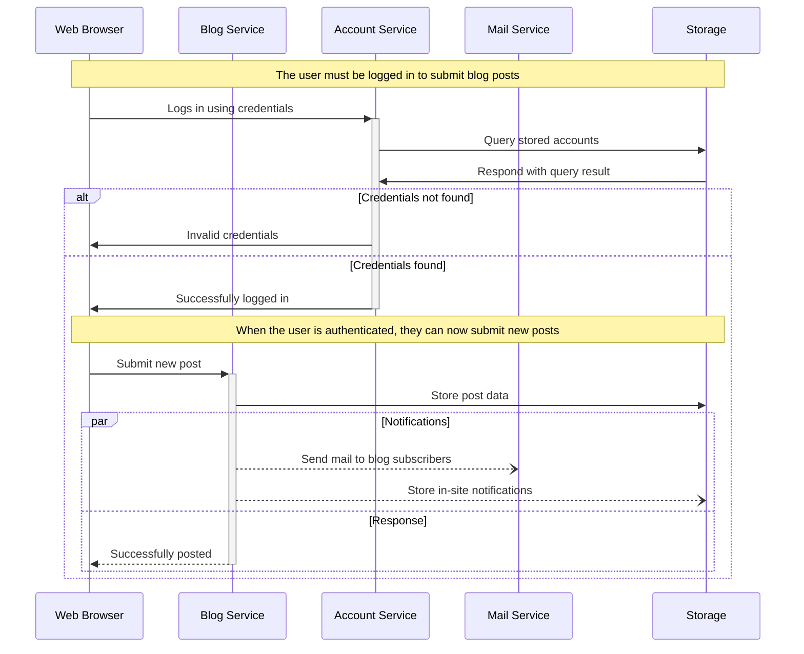

## Mermaid Diagram Cheat sheet
This is a list of all the mermaid diagrams i usually use in my day to day work for easy reference

### Gantt Chart

> [!tip]- Code
> ```
> gantt
>     title A Gantt Diagram
>     dateFormat YYYY-MM-DD
>     section Section
>         A task          :a1, 2014-01-01, 30d
>         Another task    :after a1, 20d
>     section Another
>         Task in Another :2014-01-12, 12d
>         another task    :24d
> ```



### Pie Chart
>[!tip]- Code
> ```
> pie showData
>     title Key elements in Product X
>     "Calcium" : 42.96
>     "Potassium" : 50.05
>     "Magnesium" : 10.01
>     "Iron" :  5
> ```
> 
> 




### Kanban Board

>[!tip]- Code
> ```
> kanban
>   Todo
>     [Create Documentation]
>     docs[Create Blog about the new diagram]
>   [In progress]
>     id6[Create renderer so that it works in all cases. We also add som extra text here for testing purposes. And some more just for the extra flare.]
>   id9[Ready for deploy]
>     id8[Design grammar]@{ assigned: 'knsv' }
>   id10[Ready for test]
>     id4[Create parsing tests]@{ ticket: MC-2038, assigned: 'K.Sveidqvist', priority: 'High' }
>     id66[last item]@{ priority: 'Very Low', assigned: 'knsv' }
>   id11[Done]
>     id5[define getData]
>     id2[Title of diagram is more than 100 chars when user duplicates diagram with 100 char]@{ ticket: MC-2036, priority: 'Very High'}
>     id3[Update DB function]@{ ticket: MC-2037, assigned: knsv, priority: 'High' }
> 
>   id12[Can't reproduce]
>     id3[Weird flickering in Firefox]
> ```
> 




### Sequence Diagram

>[!tip]- Code
> ```
> sequenceDiagram
>     participant web as Web Browser
>     participant blog as Blog Service
>     participant account as Account Service
>     participant mail as Mail Service
>     participant db as Storage
> 
>     Note over web,db: The user must be logged in to submit blog posts
>     web->>+account: Logs in using credentials
>     account->>db: Query stored accounts
>     db->>account: Respond with query result
> 
>     alt Credentials not found
>         account->>web: Invalid credentials
>     else Credentials found
>         account->>-web: Successfully logged in
> 
>         Note over web,db: When the user is authenticated, they can now submit new posts
>         web->>+blog: Submit new post
>         blog->>db: Store post data
> 
>         par Notifications
>             blog--)mail: Send mail to blog subscribers
>             blog--)db: Store in-site notifications
>         and Response
>             blog-->>-web: Successfully posted
>         end
>     end
> ```



