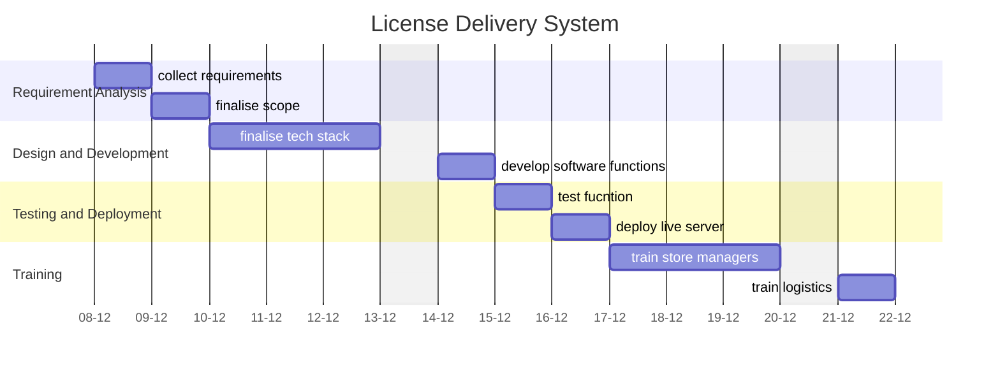

A central document for organizing, tracking, and reflecting on the progress of the **Fabrics Web Application Project**. This serves as a single source of truth for all stakeholders and contributors.

---
## Overview

### **Purpose**
- Briefly describe the problem this project aims to solve or the opportunity it addresses.

### **Scope**
- Define what the project includes and excludes to set boundaries.

### **Key Deliverables**
- List the primary outputs (e.g., functional software, documentation, analytics reports).

---
## Objectives and Success Criteria

### **Objectives**
- Clear, actionable goals the project intends to achieve.

### **Success Metrics**
- Define measurable indicators of success (e.g., user adoption rates, performance improvements).

---
## Roadmap

### **Milestones**
1. **Phase 1:** Description (Target Date)
2. **Phase 2:** Description (Target Date)
3. **Phase 3:** Description (Target Date)

### **Timeline**

---
## Tasks and Responsibilities

### **Key Tasks**
- Break down the project into actionable tasks.

### **Team Roles**
- Assign responsibilities to team members or stakeholders.

---
## Current Status

### **Progress Overview**
- Summarize what’s been completed, what’s in progress, and what’s pending.
[[progress tracker]]

### **Challenges**
- Highlight any roadblocks and potential risks.

---
## Next Steps

- Outline immediate priorities for the next phase or sprint.
- Include dependencies or tasks requiring input from others.

---
## Archive

[[ fabrics_documentation]]