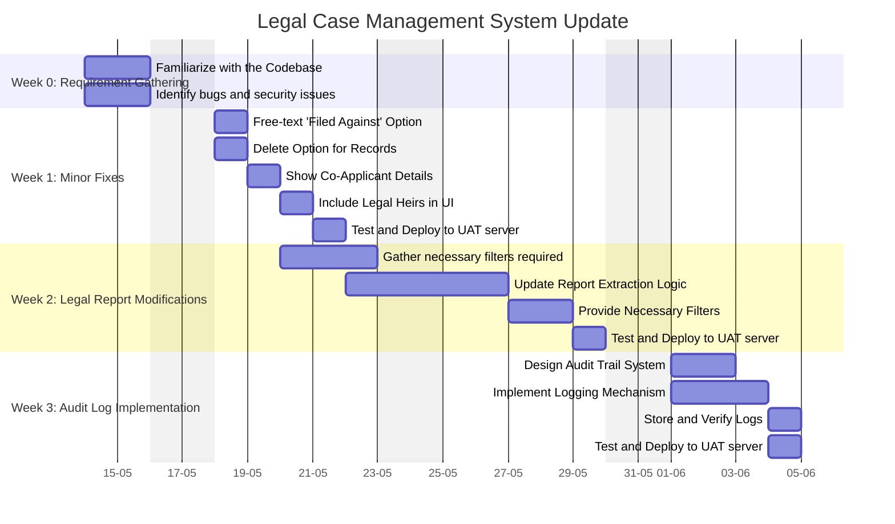

A central document for organizing, tracking, and reflecting on the progress of the **Legal Case Management System**. This serves as a single source of truth for all stakeholders and contributors.

---
## Overview

### **Purpose**
The purpose of this project is to enhance the functionality, flexibility, and auditability of the organization’s internal legal case management system. The current system lacks essential features such as record deletion, flexible data entry, audit logging, and detailed reporting — all of which are critical for efficient legal operations and compliance. By addressing these gaps, the project aims to streamline case handling, improve data visibility, and support legal workflows with reliable, actionable data.

### **Scope**
**In Scope:**
- Enhancing the “Filed Against” field to accept free-text input
- Implementing soft-delete functionality for case records
- Displaying co-applicant and legal heir information in the UI
- Logging user actions across the system (audit trail)
- Modifying the report generation feature to meet current legal requirements

**Out of Scope:**
- UI/UX redesign of the entire system
- Migration to a new framework or technology stack
- Integration with external legal databases or third-party APIs

### **Key Deliverables**
- [x] Updated case management UI with editable “Filed Against” field ✅ 2025-05-18
- [ ] Record deletion mechanism with soft-delete and admin access to deletion logs
- [x] update heading for co applicants to include legal heirs ✅ 2025-05-20
- [x] Display logic for co-applicants and legal heirs in relevant views ✅ 2025-05-19
- [ ] Full-featured audit log capturing all user activities on core models
- [ ] Customisable and filterable legal reports ready for operational use
- [ ] Internal documentation on all new features and code changes

---
## Objectives and Success Criteria

### Objectives
1. **Flexible “Filed Against” Data Entry**  
   Enable users to record any litigant name, even if it isn’t in the pre-populated dropdown.
2. **Robust Record Management**  
   Allow administrators to safely remove unwanted or duplicate records without losing traceability.
3. **Comprehensive Case Participant Visibility**  
   Surface co-applicant and legal-heir information in all relevant case views and forms.
4. **Full System Auditability**  
   Log every create, update, and delete action across the application to support compliance and forensic review.
5. **Tailored Reporting**  
   Provide the legal team with on-demand, filterable reports that match their business specifications.

---

### Success Criteria

| Objective                                    | Success Criteria                                                                                  |
|----------------------------------------------|---------------------------------------------------------------------------------------------------|
| **1. Flexible “Filed Against” Data Entry**   | - When a user types a name not in the dropdown, it is accepted and saved in the database.   - Dropdown still shows existing values; custom entry is persisted and appears in future lists. |
| **2. Robust Record Management**              | - A “Delete” action is available on every record list page.   - Deleted records are soft-deleted (flagged) and no longer visible in main lists.   - Admin can view a “Deleted Records” screen showing who deleted what and when. |
| **3. Comprehensive Case Participant Visibility** | - Co-applicant details appear under “Customer Info” on every case-edit page.   - Legal heirs appear in a clearly labeled section in both the case list and detail views. |
| **4. Full System Auditability**              | - An audit log table captures: user ID, action type (create/edit/delete), model name, record ID, timestamp.   - UI exists for filtering logs by user, date range, and action.   - All CRUD actions in Cases, Customers, and Reports are logged. |
| **5. Tailored Reporting**                    | - Reports can be generated for any date range or case status.   - Output formats include PDF and Excel.   - Generated reports match the legal team’s sample layout and include all required fields. |

---
## Roadmap

### **Milestones**
1. **Phase 1:** Minor Fixes (2025.05.23)
2. **Phase 2:** Report Generation (2025.05.30)
3. **Phase 3:** Audit Log Implementation (2025.06.05)

### **Timeline**

---
## Tasks and Responsibilities

### **Key Tasks**

#### Week 1 – Minor Fixes
- **Implement free-text input for "Filed Against"**
  - Update the database schema (if necessary) to store custom entries.
  - Modify frontend to allow both dropdown selection and text input.
  - Ensure form validation and data persistence.

- **Enable deletion of records with soft-delete**
  - Implement soft-delete logic at the database and application levels.
  - Add a "Delete" button in relevant views with confirmation prompt.
  - Create an admin view to list and restore deleted records.

- **Display co-applicant and legal heir details**
  - Retrieve and display co-applicant data in “Customer Info”.
  - Add a new section or heading for legal heirs in the case detail page.
  - Ensure relationships and data mapping are consistent.

#### Week 2 – Report Filtering
- **Revise and extend report generation logic**
  - Analyse the existing report schema and data flow.
  - Implement filters (e.g., date range, case status, type).
  - Ensure exported reports meet business formatting requirements (PDF, Excel).
  - Validate results with the legal team.

#### Week 3 – Audit Log Implementation
- **Design audit log structure**
  - Create database schema for logging user actions (user ID, model, action type, timestamp, etc.).

- **Log critical actions throughout the system**
  - Add logging hooks for create, update, and delete actions on core entities.
  - Ensure the audit log does not impact system performance.

- **Build UI for viewing and filtering logs**
  - Create an admin-only page to search logs by user, action type, or date.
  - Ensure access control and data privacy compliance.

### **Responsibilities**

| Role                  | Responsibilities                                                               |
| --------------------- | ------------------------------------------------------------------------------ |
| **Developer**         | Implement features, fix bugs, write and update documentation, conduct testing. |
| **Legal Stakeholder** | Provide requirements, test features, approve deliverables.                     |
| **Tester / QA**       | Perform functional testing and assist in sprint validation.                    |

---
## Current Status

### **Progress Overview**
- Minor feature tasks (Week 1) planned and scoped.
- Report generation logic under analysis for Week 2 sprint.
- Audit log structure to be finalized in Week 3.
- Technical decisions (e.g., soft delete, logging method) discussed.
- [[progress tracker]] ← Use this linked note to maintain daily/weekly sprint progress.

### **Challenges**
- ❗ Legacy code is undocumented and hard to trace.
- ❗ Lack of automated tests — increases risk of regressions.
- 🔐 Security concerns around audit log visibility and deleted record access.
- 🕒 Compressed timeline: final delivery required within 3 weeks.

### Concerns
- [ ] Ensure the new entries are saved and optionally added to the dropdown in future. 
- [ ] 

> 🔍 For full list of risks, open: [[issues and security concerns]]

---

## Next Steps

- [ ] Finalize field update for “Filed Against” with UI validation.
- [ ] Implement and test soft-delete logic.
- [ ] Meet with Legal to finalize report format.
- [ ] Draft database schema for audit trail system.
- [ ] Verify access control rules for admin-level actions.
- [ ] Schedule UAT review for minor changes before starting Week 2.

---

## Archive

> Notes, diagrams, outdated specs, and completed task logs can be stored here for reference.

- [[leg_case tests]]
- [[leg_case meeting notes]]
- [[leg_case bugs]]
- [[leg_case issues and security concerns]]

---