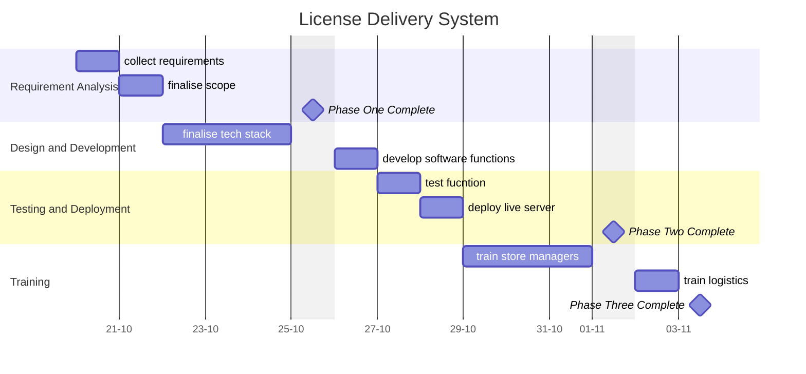

A central document for organizing, tracking, and reflecting on the progress of the **License Delivery System**. This serves as a single source of truth for all stakeholders and contributors.

---
## Overview

### **Purpose**
- The main purpose of this project was to digitize and automate the current business transaction of selling digital software license keys to customers

### **Scope**
- create a customer facing web application to retrieve their software license key online
- create a backend system for staff to add, assign and review license keys and logs of all transaction
- integrate email, WhatsApp and SMS for customer convenience

### **Key Deliverables**
- Functional Software
	- A customer-facing web application to retrieve and view their license keys
	- Backend platform for staff to add and assign license keys to customers
- Documentation
	- Software development documentation of technology used
	- Staff training guide

---
## Roadmap

### **Milestones**
1. **Phase 1:** Requirement Gathering
2. **Phase 2:** Minimum Viable Product / Prototype
3. **Phase 3:**  Project handover

### **Timeline**

---
## Tasks and Responsibilities

### **Key Tasks**
- WhatsApp API integration
- Mail integration
- SMS integration
- Bulk upload of software licenses
- generate reports on logs and license keys

### **Team Roles**
- This project was assigned to 2 people

---
## Current Status

### **Progress Overview**
- Project marked complete

### **Challenges**
- Third Part SMS provider API was non-functional. No way of finding a new provider withing the project timeline

---
## Next Steps

- currently this project is in maintenance mode

---
## Resources and Tools

- **Documentation:** Link to technical docs, guides, or project charters.
- **Tools:** Mention key tools or platforms (e.g., GitHub, Jira, Figma).
- **References:** Link to any research, APIs, or standards being followed.

---
## Communication Plan

- **Meeting Cadence:** Frequency of team check-ins or stakeholder updates.
- **Key Contacts:** List primary points of contact and their roles.

---
## Retrospective

- **Lessons Learned:** Reflect on successes and areas for improvement.
- **Outcomes:** Summarize final results and how they compare to initial goals.
- **Future Opportunities:** Highlight ideas or next steps stemming from this project.

---
## Appendices

- **Project Files:** Include links to relevant files, repositories, and mockups.
- **Change Log:** Record major updates or decisions affecting the project scope or timeline.