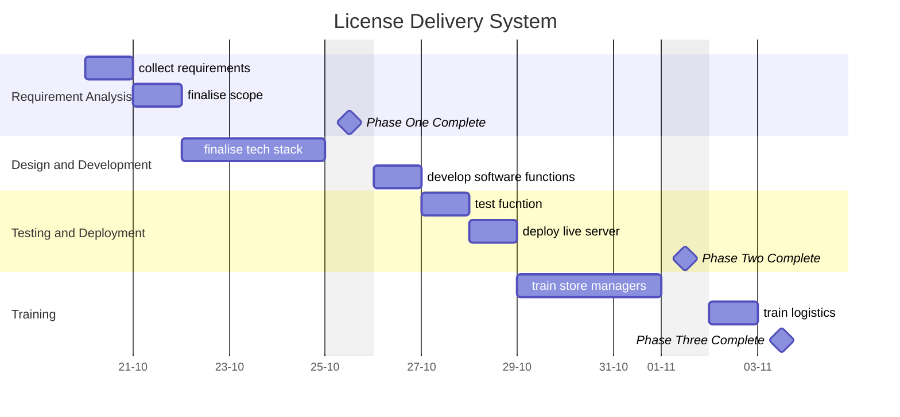

A central document for organizing, tracking, and reflecting on the progress of the **License Delivery System**. This serves as a single source of truth for all stakeholders and contributors.

---
## Overview

### **Purpose**
- The main purpose of this project was to digitize and automate the current business transaction of selling digital software license keys to customers

### **Scope**
- create a customer facing web application to retrieve their software license key online
- create a backend system for staff to add, assign and review license keys and logs of all transaction
- integrate email, WhatsApp and SMS for customer convenience
- provide a way to confirm the customer has accessed and retrieved their key from the system

### **Key Deliverables**
- Functional Software
	- A customer-facing web application to retrieve and view their license keys
	- Backend platform for staff to add and assign license keys to customers
	- A dashboard to manage all keys and see data related to the system
- Documentation
	- Software development documentation of technology used
	- Staff training guide

---
## Roadmap

### **Milestones**
1. **Phase 1:** Requirement Gathering
2. **Phase 2:** Minimum Viable Product / Prototype
3. **Phase 3:**  Project handover

### **Timeline**

```mermaid 
gantt
    title License Delivery System
    dateFormat YYYY-MM-DD
    axisFormat %d-%m
    excludes friday
    section Requirement Analysis
        collect requirements          :a1, 2024-10-20, 1d
        finalise scope                :a2,after a1, 1d
	    Phase One Complete : milestone, m1, 2024-10-25, 1d
    section Design and Development
        finalise tech stack           :a3, after a2, 3d
		develop software functions    :a4, after a3, 1d
    section Testing and Deployment
        test fucntion                 :a5, after a4, 1d
        deploy live server            :a6, after a5, 1d
        Phase Two Complete : milestone, m1, 2024-11-01, 1d
    section Training
        train store managers          :a7, after a6, 3d
		train logistics               :after a7, 1d
		Phase Three Complete : milestone, m1, 2024-11-03, 1d
```

---
## Tasks and Responsibilities

### **Key Tasks**
- WhatsApp API integration
- Mail integration
- SMS integration
- Bulk upload of software licenses
- generate reports on logs and license keys
- tracker to see where when and who accesses license keys

### **Team Roles**
- This project was assigned to 2 people

---
## Current Status

### **Progress Overview**
- Project marked complete

### **Challenges**
- Third Part SMS provider API was non-functional. No way of finding a new provider withing the project timeline

---
## Next Steps

- currently this project is in maintenance mode

---
## Resources and Tools

- **Documentation:** 
- **Tools:** 
	- [[WhatsApp Business API Setup]]
- **References:** 
	- [WhatsApp API Documentation](business.whatsapp.com/developers/developer-hub)

---
## Communication Plan

- **Meeting Cadence:** weekly manager meeting
- **Key Contacts:** REDACTED

---
## Retrospective

- **Lessons Learned:** 
	- **API Dependencies Can Be Risky** – The project relied on a third-party SMS provider that became non-functional, which highlighted the risks of external dependencies. Future projects should evaluate alternative providers early in the process.
	- **Early Testing is Crucial** – Testing integrations (WhatsApp, email, and SMS) early helped identify potential roadblocks before deployment.
	- **User Experience Matters** – Providing a simple, intuitive way for customers to retrieve their license keys significantly improved adoption and reduced support requests.
- **Outcomes:** 
	- A fully functional, automated **License Delivery System** was successfully deployed.
	- Customers can now retrieve their software license keys online with minimal friction.
	- staff from all over the company can efficiently manage license key assignments, reducing manual workload and reliance on Excel sheets and one person having to manage the keys for security purposes.
	- Integrated tracking and reporting improved transparency in license key access and usage.
- **Future Opportunities:** 
	- **Alternative SMS Provider Integration** – Given the challenges faced, evaluating and integrating a backup SMS provider could improve reliability.
	- **Enhancing Customer Notifications** – Exploring push notifications or in-app alerts to complement email, WhatsApp, and SMS.
	- **Expanding License Management Features** – Future enhancements could include auto-renewal reminders, extended reporting, or customer self-service features for managing multiple licenses.

---
## Appendices

- **Project Files:~~** **REDACTED**~~
- **Change Log:** 