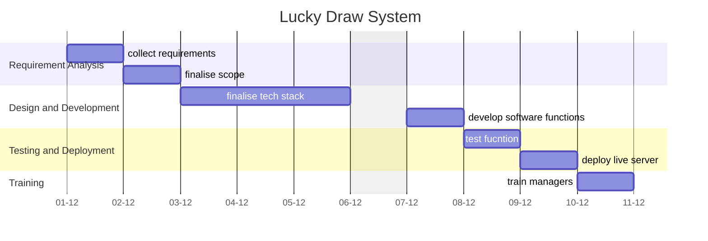

A central document for organizing, tracking, and reflecting on the progress of the **Lucky Draw System**. This serves as a single source of truth for all stakeholders and contributors.

---
## Overview

### **Purpose**
The Lucky Draw System was developed to facilitate a fair and transparent winner selection process for promotions held at work. The application provides a visually engaging and randomized way to select a winner from a list of participants.
### **Scope**
- **Includes:**
	- Uploading an Excel sheet containing names and phone numbers of participants.
	- Randomized cycling of numbers per millisecond with a slightly blurred effect.
	- Manager-controlled stopping mechanism to reveal the winner.
	- Confetti animation to enhance the celebratory experience.
	- Designed for livestreaming events.
- **Excludes:**
	- Online participation or user submissions.
	- Persistent storage of draw results beyond the session.
	- Multi-session tracking and analytics.

### **Key Deliverables**
- A fully functional Flask-based web application.
- A user-friendly interface for managers to upload participant data and control the draw process.
- A randomized selection mechanism with real-time visual effects.
- Documentation on setup, deployment, and usage.

---
## Objectives and Success Criteria

### **Objectives**
- Provide a seamless and engaging lucky draw experience for promotions.
- Ensure fairness and transparency in winner selection.
- Enable easy deployment and usage with minimal technical requirements.

### **Success Metrics**
- Successful execution of live draws without technical issues.
- Positive user feedback on ease of use and effectiveness.
- Performance stability with rapid number cycling and smooth animations.

---
## Roadmap

### **Milestones**
1. **Phase 1:** Initial Development (Completed)
2. **Phase 2:** Testing and Bug Fixes (Completed)
3. **Phase 3:** Deployment and Live Event Execution (Completed)

### **Timeline**

---
## Tasks and Responsibilities

### **Key Tasks**
- Develop Flask backend for file upload and random selection logic.
- Implement real-time number cycling with slight blurring.
- Create UI for easy manager control.
- Optimize performance for seamless live execution.

### **Team Roles**
- **Developer:** Build and maintain the application.
- **Event Manager:** Use the application during live promotions.
- **Tester:** Validate functionality and resolve potential bugs.

---
## Current Status

### **Progress Overview**
- Application has been successfully developed and used in a live event.
- Basic documentation is available.
- No major technical issues encountered during deployment.

### **Challenges**
- Ensuring smooth animations and seamless stopping mechanism.
- Handling large Excel files efficiently.

---
## Next Steps

- Improve UI design for better aesthetics.
- Add optional logging for draw results (if needed in the future).
- Optimize file handling for larger participant lists.

---
## Resources and Tools

- **Documentation:** Setup and user guide.
- **Tools:** 
	- Flask 
	- Python
	- JavaScript (for UI effects) 
	- Excel processing libraries (pandas, openpyxl).
- **References:**
	- [Flask Documentation](flask.palletsprojects.com/en/stable/)

---
## Communication Plan

- **Meeting Cadence:** Ad-hoc discussions as needed.
- **Key Contacts:** ~~**REDACTED**~~

---
## Retrospective

- **Lessons Learned:** 
	- Optimizing animations was crucial for a smooth experience.
	- Simple UI controls enhanced usability.
- **Outcomes:**
	- Successfully executed live draws with positive feedback.
- **Future Opportunities:**
	- Expand functionality for broader use cases (e.g., multi-event tracking, additional winner selection modes).

---
## Appendices

- **Project Files:** ~~**REDACTED**~~
- **Change Log:** No changes made