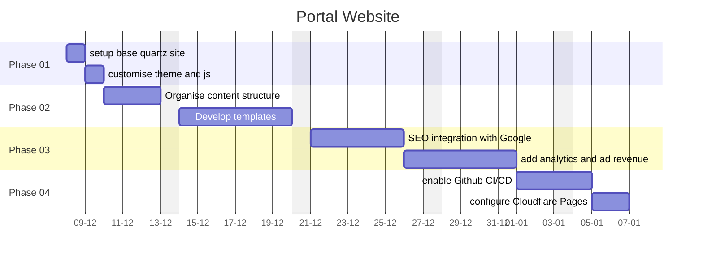

A central document for organizing, tracking, and reflecting on the progress of the **Portfolio Website**. This serves as a single source of truth for all stakeholders and contributors, in this case, it's just me 😁

---
## Overview

### **Purpose**
- The portfolio website is designed to showcase projects and share software development learnings in a structured and easily accessible manner. It acts as a personal knowledge base and professional profile.

### **Scope**
- Includes:
	- Conversion of Obsidian notes into a static website using Quartz.
	- A clean, minimalist design optimized for readability and navigation.
	- Sections for projects, resources, and other relevant content.
	- Easy updates by writing new notes in Obsidian.

- Excludes:
	- Dynamic features like user authentication or commenting systems.
	- Advanced CMS functionalities beyond note conversion.

### **Key Deliverables**
- A fully functional static website built using Quartz.
- A structured system for updating and managing content via Obsidian.
- - Documentation on setup, customization, and deployment.

---
## Objectives and Success Criteria

### **Objectives**
- Provide a seamless way to share projects and technical knowledge.
- Ensure the website remains lightweight and fast-loading.
- Make content updates straightforward via Obsidian and Git integration

### **Success Metrics**
- Smooth synchronization between Obsidian notes and the website.
- Increased engagement and visibility of shared content.
- Positive feedback on usability and design.

---
## Roadmap

### **Milestones**
1. **Phase 1:** Set up Quartz and configure base website (Completed)
2. **Phase 2:** Organize content structure and optimize design (Completed)
3. **Phase 3:** Improve discoverability (SEO, social sharing) (Planned)
4. **Phase 4:** Enhance customization and automation for content updates (Planned)

### **Timeline**

---
## Tasks and Responsibilities

### **Key Tasks**
- Configure Quartz and link it to the Obsidian vault.
- Customize website design for branding and readability.
- Enable custom JS for more unique UI / UX
- Organize content into sections (Projects, Areas, Resources, Archive etc.).
- Optimize performance and accessibility.
- Implement SEO best practices.

### **Team Roles**
- Sole Developer for this project

---
## Current Status

### **Progress Overview**
- Website is live and functional.
- Basic design and content structure are in place.
- Improvements for SEO and automation are ongoing.

### **Challenges**
- Ensuring seamless updates between Obsidian and the live site.
- Optimizing site navigation for better user experience.
- Enhancing discoverability through SEO.

---
## Next Steps

- Improve site metadata and search indexing.
- Implement automated content updates for smoother workflows.
- Explore additional design refinements for better readability.

---
## Resources and Tools

- **Documentation:** Quartz setup and customization guide.
- **Tools:** Quartz (Static Site Generator), Obsidian (Content Management), GitHub (Version Control), Cloudflare Pages (Hosting).
- **References:** Markdown best practices, SEO guidelines.

---
## Communication Plan

- **Meeting Cadence:** Self-managed updates as needed.
- **Key Contacts:** NONE

---
## Retrospective

- **Lessons Learned:**
    - Quartz provides a simple yet powerful way to publish notes.
    - Structuring content properly enhances usability.
- **Outcomes:**
    - Website successfully deployed with an easy update mechanism.
- **Future Opportunities:**
    - Automate more aspects of the publishing process.
    - Expand to include interactive elements like project demos.

---
## Appendices

- **Project Files:** Include links to relevant files, repositories, and mockups.
- **Change Log:** Record major updates or decisions affecting the project scope or timeline.

---
