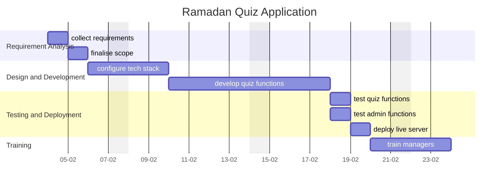

A central document for organizing, tracking, and reflecting on the progress of the **Ramadan Quiz Application**. This serves as a single source of truth for all stakeholders and contributors.

---
## Overview

### **Purpose**
- the development of the application is to provide a way to host competitions for the customers and staff during Ramadan

### **Scope**
- Develop a Laravel based web app for the quiz
- Implement different question sets for admins, employees and customers
- Ensure daily questions and weekly prize tracking
- Integrate user authentication and leaderboards

### **Key Deliverables**
- Functional web application with authentication
- database with seeded questions
- user roles and access control setup
- a home page, quiz page and a leaderboard page
- a dashboard page for admins to configure and monitor the application

---
## Objectives and Success Criteria

### **Objectives**
- provide a way to promote our products within the quiz app
- increase customer engagement with key points

### **Success Metrics**
- Project completion before the start of Ramadan
- main functions of quiz working correctly

---
## Roadmap

### **Milestones**
1. **Phase 1:** Requirement Gathering [[2025-02-05]]
2. **Phase 2:** Complete Development [[2025-02-18]]
3. **Phase 3:** Launch Application [[2025-02-25]]

### **Timeline**

---
## Tasks and Responsibilities

### **Key Tasks**
- Create models, factories and seeders required for the application
- Create authentication and roles and permission access
- seed the database
- create the frontend for customer and employee quiz
- create the backend management for admins
- test the application
- deploy to the live server

### **Team Roles**
- Assign responsibilities to team members or stakeholders.

---
## Current Status

### **Progress Overview**
- Summarize what’s been completed, what’s in progress, and what’s pending.

### **Challenges**
- Highlight any roadblocks and potential risks.

---
## Next Steps

- Outline immediate priorities for the next phase or sprint.
- Include dependencies or tasks requiring input from others.

---
## Resources and Tools

- **Documentation:** Link to technical docs, guides, or project charters.
	- etc
- **Tools:** Key tools or platforms
	- etc
- **References:** Link to any research, APIs, or standards being followed.
	- etc

---
## Communication Plan

- **Meeting Cadence:** twice weekly. meeting notes referenced in daily notes
	- ~~REDACTED~~
- **Key Contacts:** List primary points of contact and their roles.
	- ~~REDACTED~~

---
## Retrospective

- **Lessons Learned:** Reflect on successes and areas for improvement.
- **Outcomes:** Summarize final results and how they compare to initial goals.
- **Future Opportunities:** Highlight ideas or next steps stemming from this project.

---
## Appendices

- **Project Files:** links to relevant files, repositories, and mock-ups.
- **Change Log:**  major updates or decisions affecting the project scope or timeline.