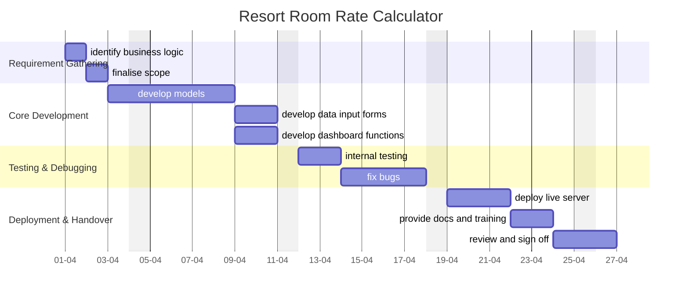

A central document for organizing, tracking, and reflecting on the progress of the **Resort Room Rate Calculator**. This serves as a single source of truth for all stakeholders and contributors.

---
## Overview

### **Purpose**
The Developer will build a web-based Room Rate Calculator, which allows users to select necessary information, apply calculations, and generate an Excel file from a predefined template..

### **Scope**
- Includes:
	- Seasonal Pricing Configuration: Admins can set different pricing tiers for specific dates and adjust them as needed.
	- Discount Management: The app will include an interface to apply fixed or percentage-based discounts and evaluate the impact on the invoice in real time.
	- Rate Tracking and History: A built-in tracker for monitoring when and why rates were adjusted, aiding financial analysis and seasonal planning.
	- Automated Invoice Generation: After calculating rates and discounts, the app will generate a professional invoice that can be printed or emailed directly to guests.
	- User Access Controls: Role-based access for different staff levels (e.g., Admin, Sales), allowing only authorized personnel to adjust rates or apply discounts.
	- Reporting Dashboard: A simple dashboard to view historical data, seasonal revenue, and discount usage over time.
	
- Excludes:
	- Opera on Premise PMS integration
	- Mailing functionality to guests and stakeholders
	- Notification system

### **Key Deliverables**
- List the primary outputs (e.g., functional software, documentation, analytics reports).

---
## Objectives and Success Criteria

### **Objectives**
- Seamless Rate Adjustments: Set and adjust seasonal pricing efficiently.
- Automated Discounts: Easily apply fixed or percentage-based discounts.
- Rate Tracking: Track rate changes for financial insights and trend analysis.
- Improve Operational Efficiency: Reduce time spent on invoicing, freeing up staff for other important customer-facing tasks.

### **Success Metrics**
- Ability to easily make room rate calculations
- Managers are easily able to dynamically change calculation variables such as seasonal dates, meal plans, room details etc

---
## Roadmap

### **Milestones**
1. - Phase 1: Requirement Gathering
    - finalize the business logic for calculations
    - create data models for calculations
- Phase 2: Core Development
    - Develop the data input form.
    - Implement the calculation engine.
    - Integrate the dashboard and Excel export functionality.
- Phase 3: Testing & Debugging
    - Conduct internal testing for functionality and performance.
    - Fix any identified bugs and optimize the system.
- Phase 4: Deployment & Handover
    - Deploy the final version to the production environment.
    - Provide documentation and basic training if required.
    - Final review and sign-off by the client.

### **Timeline**

---
## Tasks and Responsibilities

### **Key Tasks**
- Currently waiting on payment

### **Team Roles**
- single developer

---
## Current Status

### **Progress Overview**
- Currently waiting on payment

### **Challenges**
- Finalising business logic: Gathering data about the business process has been difficult. Client is not available due to huge timezone differences and work constraints. 

---
## Next Steps

- Prepare for development cycle

---
## Communication Plan

- **Meeting Cadence:** twice per milestone phase. confirm scope and functions.
- **Key Contacts:** ~~**REDACTED**~~

---
## Retrospective

- **Lessons Learned:** Reflect on successes and areas for improvement.
- **Outcomes:** Summarize final results and how they compare to initial goals.
- **Future Opportunities:** Highlight ideas or next steps stemming from this project.

---
## Appendices

- **Project Files:** Include links to relevant files, repositories, and mockups.
- **Change Log:** Record major updates or decisions affecting the project scope or timeline.