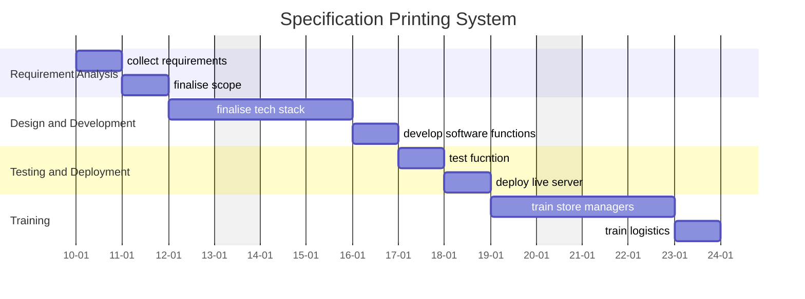

A central document for organizing, tracking, and reflecting on the progress of the **Specification Printing System**. This serves as a single source of truth for all stakeholders and contributors.

---
## Overview

### **Purpose**
- The Specification Printing System was developed to automate the generation of product specification sheets for printing and in-store display. Previously, spec sheets had to be manually designed for each product during promotions, which was time-consuming and inefficient.

### **Scope**
- Includes:
	- Integration with the Odoo database to retrieve product data.
	- A user-friendly interface for managers to select products.
	- Automated generation of 3x3 inch spec sheets.
	- Compilation of multiple spec sheets into an A4 layout for efficient printing.
- Excludes:
	- Direct modification of product data within the app.
	- Advanced graphic design features beyond template-based spec sheet generation.

### **Key Deliverables**
- A Laravel-based web application with a product selection interface.
- Automated spec sheet generation and A4 layout compilation.
- Seamless integration with the Odoo database.
- User documentation for managing and printing spec sheets.

---
## Objectives and Success Criteria

### **Objectives**
- Eliminate the manual effort required to design spec sheets.
- Ensure accurate product data retrieval from Odoo.
- Provide an efficient and easy-to-use tool for managers.
- Optimize printing layouts to reduce paper waste.

### **Success Metrics**
- Time reduction in creating spec sheets compared to manual design.
- High accuracy in product details retrieved from Odoo.
- Positive feedback from managers on usability and efficiency.
- Minimal errors or adjustments required before printing.

---
## Roadmap

### **Milestones**
1. **Phase 1:** Develop Laravel application with Odoo integration (Completed)
2. **Phase 2:** Implement spec sheet generation and A4 compilation (Completed)
3. **Phase 3:** Optimize UI/UX for manager selection process (Completed)
4. **Phase 4:** Improve print quality and layout customization (On Hold)

### **Timeline**

---
## Tasks and Responsibilities

### **Key Tasks**
- Establish connection with Odoo database.
- Create selection interface for managers to choose products.
- Develop spec sheet generation logic and template system.
- Implement A4 compilation to fit multiple spec sheets efficiently.
- Optimize printing resolution and formatting.

### **Team Roles**
- **Developer:** Maintains Laravel application and database integration.
- **Manager:** Selects products and manages printing workflow.
- **Design Specialist:** Refines spec sheet templates for clarity and readability.

---
## Current Status

### **Progress Overview**
- The system is functional and in use for generating spec sheets.
- Product selection and printing workflow have been streamlined.
- Work is ongoing to refine the print layout and customization features.

### **Challenges**
- Ensuring consistent print quality across different printers.
- Handling edge cases where product descriptions exceed the template size.
- Potential need for additional customization options for different promotions.

---
## Next Steps

- Enhance print customization features to allow slight adjustments.
- Improve error handling when fetching product data from Odoo.
- Test and refine layout for different product categories.

---
## Resources and Tools

- **Documentation:** Laravel project setup and Odoo API integration guide.
- **Tools:** Laravel (Backend), Odoo API (Data Source), Bootstrap (UI), PDF Generation Library.
- **References:** Printing best practices, Laravel PDF generation techniques.

---
## Communication Plan

- **Meeting Cadence:** Regular check-ins for feedback and improvements.
- **Key Contacts:** ~~**Redacted**~~

---
## Retrospective

- **Lessons Learned:**
	- Automating spec sheet generation significantly reduced workload.
	- Standardized templates ensure consistency across promotions.
	- Additional flexibility in customization may be needed for varied marketing needs.
- **Outcomes:**
	- Successfully automated a previously manual process.
- **Future Opportunities:**
	- Implement direct editing of spec sheets within the app.
	- Explore dynamic templates for different promotional needs.