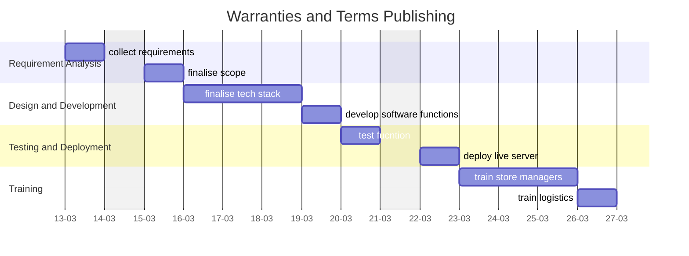

A central document for organizing, tracking, and reflecting on the progress of the **Warranties and Terms Publishing**. This serves as a single source of truth for all stakeholders and contributors.

---
## Overview

### **Purpose**
- The Warranties and Terms Publishing Website was created to provide a structured and easily accessible platform for publishing terms and conditions related to warranties for Personal Computers. The project leverages Quartz for quick deployment and a graph-based view of interconnected terms.

### **Scope**
- Includes:
	- Publishing terms and conditions using the Quartz static site generator.
	- Utilizing the graph view to help visualize relationships between different warranties and terms.
	- Providing a fast, lightweight solution for hosting structured legal content.
- Excludes:
	- A dynamic CMS or database-driven content management.
	- User authentication, editing, or submission of content directly from the website.
	- Advanced search or filtering functionalities beyond basic linking.

### **Key Deliverables**
- A static website built using Quartz, displaying structured legal terms.
- Graph view representation of warranties and their interconnections.
- Documentation for setup, customization, and content updates.

---
## Objectives and Success Criteria

### **Objectives**
- Ensure warranties and terms are accessible in a structured and visually clear manner.
- Provide an easy way to navigate and understand interconnected warranties.
- Enable rapid deployment and maintenance with minimal overhead.

### **Success Metrics**
- Accurate representation of terms and conditions without formatting issues.
- Positive feedback from users on readability and navigation.
- Minimal downtime or maintenance required for hosting.

---
## Roadmap

### **Milestones**
1. **Phase 1:** Setup Quartz and deploy initial website (Completed)
2. **Phase 2:** Organize warranties and terms using structured markdown (Completed)
3. **Phase 3:** Improve navigation and linking between terms (Completed)
4. **Phase 4:** Explore alternatives for easier content updates (On Hold)

### **Timeline**

---
## Tasks and Responsibilities

### **Key Tasks**
- Convert warranties and terms into structured Markdown files.
- Set up Quartz for static site generation.
- Optimize the graph view to clearly show interconnections.
- Improve documentation for internal updates.
- Evaluate potential CMS alternatives for easier content management.

### **Team Roles**
- **Developer:** Maintains and updates Quartz setup.
- **Legal Team:** Provides updated terms and warranties.
- **Content Manager:** Organizes and structures terms within the site.

---
## Current Status

### **Progress Overview**
- Website is live and functional, displaying warranty terms effectively.
- Graph view enhances readability and understanding of interconnections.
- Updating terms remains a challenge due to the static nature of Quartz.

### **Challenges**
- Difficulty in updating terms without technical knowledge.
- Limited flexibility for non-technical managers to modify content.
- Lack of an easy-to-use CMS for more intuitive content updates.

---
## Next Steps

- Research and test CMS solutions that allow non-technical users to update terms easily.
- Automate content updates while preserving the structured linking system.
- Improve site searchability and filtering options.

---
## Resources and Tools

- **Documentation:** Quartz setup and update guide.
- **Tools:** Quartz (Static Site Generator), Obsidian (Content Management), GitHub (Version Control), Netlify/Vercel (Hosting).
- **References:** Markdown best practices, CMS evaluation reports.

---
## Communication Plan

- **Meeting Cadence:** Frequency of team check-ins or stakeholder updates.
- **Key Contacts:** ~~**Redacted**~~

---
## Retrospective

- **Lessons Learned:**
    - Quartz enabled fast and structured deployment.
    - Graph view helped visualize warranty relationships effectively.
    - A more user-friendly CMS is needed for content updates.

- **Outcomes:**
    - Successfully published terms and conditions.

- **Future Opportunities:**
    - Transition to a CMS for easier editing.
    - Implement a hybrid solution that retains the benefits of Quartz while allowing non-technical updates.

---